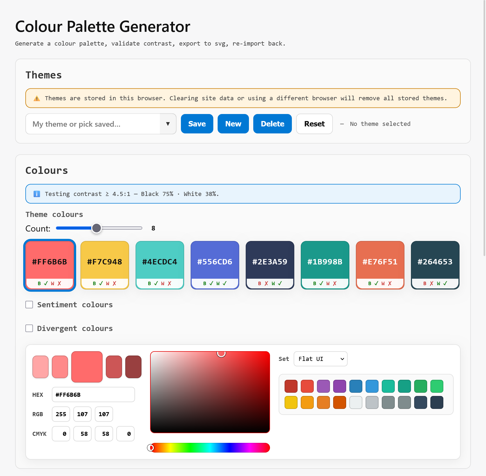

#  Power BI Theme Customiser: [Launch](https://filcuk.github.io/pbi-theme-customiser/)

 
  

> [!IMPORTANT]
> This project is almost entirely vibe-coded.

A theme/colour palette generator, predominantly for use in [MS Power BI](https://www.microsoft.com/en-us/power-platform/products/power-bi).

## Features
- **🧮 Variable colour count**: pick how many theme colours you need
- **📊 Sentiment and divergent colours**: with gradient preview & export
- **⌨️ Flexible inputs**: including HEX, RGB, CYMK, colour picker, and predefined colour sets
- **🔲 Contrast checks**: validation for black and white text at 4.5:1 or higher
- **🎨 Theme management**: using browser local storage with automatic saving
- **⌛ Undo**: step back through colour changes and other actions
- **📤 Export with preview**: SVG image and Power BI JSON theme file
- **📥 Import**: restore from exported JSON/SVG or a standard Power BI theme JSON
- **🔗 Share via URL**: forward the link; the address bar holds the current theme state

> [!TIP]
> Tested on Firefox. Please submit any issues or suggestions [here](https://github.com/filcuk/pbi-theme-customiser/issues).



# Development
## Project layout

| Path | Role |
|------|------|
| `index.html` | Page markup |
| `css/styles.css` | Styles |
| `js/main.js` | App entry: DOM refs, wiring, bootstrap |
| `js/state.js` | Palette state, persistence, URL hash |
| `js/ui.js` | Swatches, contrast summary, slider, optional rows, colour picker |
| `js/themes.js` | Saved named themes (localStorage) |
| `js/import-export.js` | JSON/SVG preview, copy, download, file + drag/drop import |
| `js/colour-math.js` | Hex / RGB / HSV / CMYK / contrast helpers |
| `js/colour-export.js` | JSON + SVG export (shared with unit tests) |

## Run locally

The page loads **ES modules** (`<script type="module" src="js/main.js">`). Most browsers **do not** allow module scripts from `file://` URLs, so opening `index.html` by double‑clicking it will fail with a console error like “Module source URI is not allowed in this document”.

From the repo root:

```bash
npm install
npm start
```

That serves the project on **http://127.0.0.1:8080** and opens your browser. To serve without opening a tab, use `npm run serve` instead.

## Testing

**Prerequisites:** [Node.js](https://nodejs.org/) (includes `npm`).

### Unit tests (Vitest)

JSON and SVG export behaviour is implemented in `js/colour-export.js` and covered by `tests/unit/export.test.js`.

| Command | What it does |
|--------|----------------|
| `npm run test` | Run unit tests once (CI default). |
| `npm run test:watch` | Re-run unit tests when files change. |

### End-to-end tests (Playwright)

E2E tests live in `tests/e2e/`. Playwright starts a local static server for the repo root (so `index.html` and `js/` are served automatically); you do not need a separate dev server.

**One-time setup**

```bash
npm install
npx playwright install chromium
```

| Command | What it does |
|--------|----------------|
| `npm run test:e2e` | Run all E2E tests (headless Chromium). |
| `npm run test:e2e:ui` | Open the Playwright UI to pick tests and watch runs. |
| `npm run test:e2e:headed` | Run with a visible browser window. |
| `npm run test:e2e:debug` | Step through tests with the Playwright inspector. |

After an E2E run, an HTML report may appear under `playwright-report/` (open `index.html` in a browser to view it).

**CI:** Pushes and pull requests to `main` run unit tests and E2E tests via GitHub Actions (`.github/workflows/playwright.yml`). Failed E2E runs upload the Playwright report as an artifact.